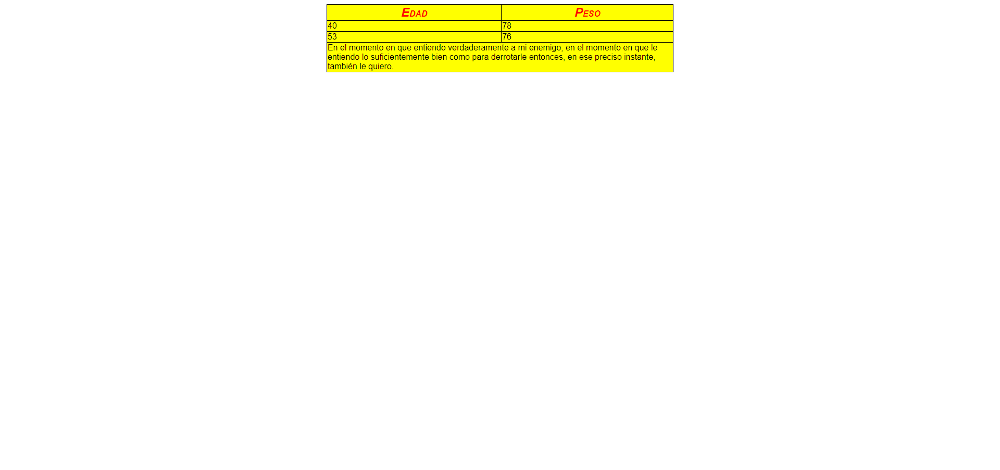

<h1>Taller 9: Julio Cesar Murillo Chaverra</h1>

<h2> Información</h2>

Curso: Full Stack Básico - Grupo 1

Profesor: Cristian Patiño

<h2> Punto 1: Link de figma</h2>
<a href="https://www.figma.com/file/XH19u7GYurt6SH6CeYvjUy/Julio-Cesar-Murillo---Figma---Ejercicio?type=design&node-id=0%3A1&mode=design&t=3vzousXvxa0LSvFZ-1">Link de Figma</a>

<h2> Punto 2: HTML</h2>

<h2> Punto 3: CSS</h2>

<h2> Punto 4: Títulos</h2>

<h2> Punto 5: Estilos de texto</h2>

<h2> Punto 6: Enlaces</h2>

<h2> Punto 7-8: Navegación</h2>

<h2> Punto 9: Tablas</h2>

